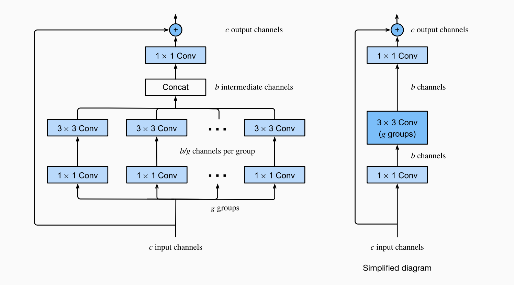

# Face Recognition 

This project focuses on building a CNN-based model for effective face recognition. Below is an overview of the data preprocessing steps, model architecture, hyperparameters, and some alternative tried approaches.

---
## Data Preprocessing
### 1. Basic Transformation
- **Resize**: All images are resized to a fixed size of `112x112` pixels. 
- **ToDtype**: Converts the image data type to `torch.float32` and scales pixel values to the range `[0, 1]`

### 2. Data Augmentation
- **Random Horizontal Flip**: Flips the image horizontally with a probability of 50%
- **Random Rotation**: Rotates the image randomly within a range of ±10 degrees.
- **Color Jitter**: Randomly adjusts brightness, contrast, saturation, and hue with respective limits of `0.2, 0.2, 0.2, and 0.1`.
- **Random Erasing**: Randomly erases a portion of the image with a probability of 10%, using a scale range of `0.02 to 0.15` and an aspect ratio of `(0.5, 2.0)`.
- **Random Grayscale**: Converts the image to grayscale with a probability of 10%.
- **Random Perspective**: Introduces slight distortions with a `distortion_scale` of 0.1 and a probability of 10%.

---
## Model Architecture
### ResNext Block

#### 1. Initial Convolutional Layer
- A 7x7 convolution with 64 filters and stride 2, followed by BatchNorm and ReLU activation.  
- A 3×3 max-pooling operation to downsample the feature map.

#### 2. ResNeXt Blocks:
| Stage    | # Blocks | Input Channels | Intermediate Channels | Output Channels | Downsampling                                |
|----------|---------|----------------|-----------------------|-----------------|--------------------------------------------|
| **Stage 1** | 3       | 64             | 64                    | 128             | No downsampling                            |
| **Stage 2** | 4       | 128            | 128                   | 256             | Downsampling at first block (stride=2)     |
| **Stage 3** | 6       | 256            | 256                   | 512             | Downsampling at first block (stride=2)     |
| **Stage 4** | 2       | 512            | 1024                  | 2048            | Downsampling at first block (stride=2)     |

#### 3. Global Pooling and Fully Connected Layer:
- A global average pooling layer reduces spatial dimensions to 1×1.
- A fully connected classification layer

### Loss Function
- **ArcFace Loss**

## Ablation 
- **Link to Wandb:**  
https://wandb.ai/11785-DL/HW2P2?nw=nwuserpeng_qiu

---

## Run the Code  
- The main script is in `main.ipynb`. Follow the instructions there to run it. 