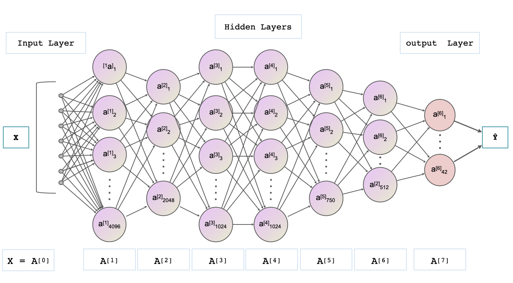
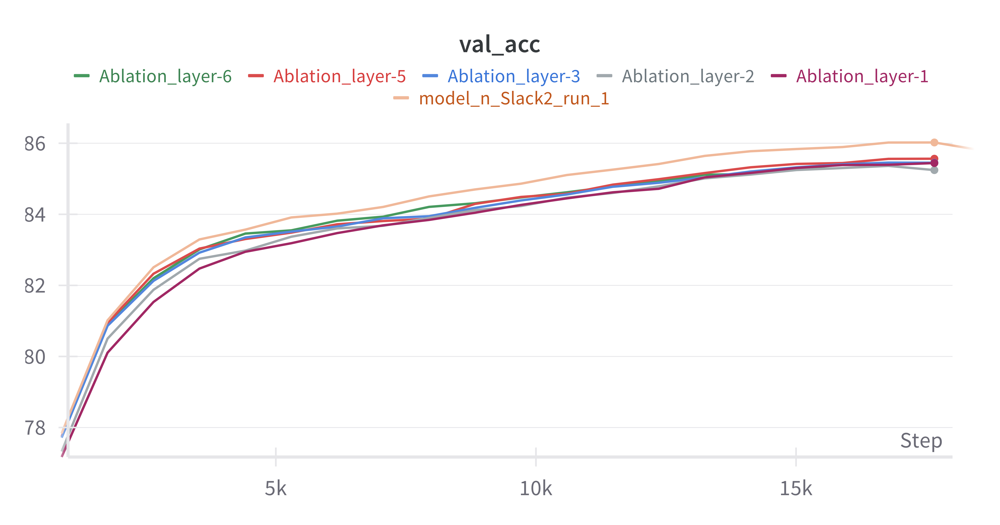

# Speech Recognition 

This project focuses on a MLP-based speech recognition model to effectively recognize and label the phoneme states in the training data. Below is an overview of the data preprocessing steps, model architecture, hyperparameters, and some alternative tried approaches.

---

### Data Preprocessing
- **MFCC Features:**    
The MFCC data is Cepstral normalized along the time axis, and zero-padded at both ends to help with context division.

- **Transcripts:**  
Transcripts are cleaned by removing the start (`[SOS]`) and end (`[EOS]`) tokens. Each phoneme in the transcript is then mapped to a discrete number.

- **Data Augmentation:**  
 During training, with a 70% probability, frequency masking or time masking are applied to the MFCCs to augment the data for robustness. 

---

### Model Artitecture

- **Activation Function:** SiLu  
- **Dropout:** A dropout layer is added after layers A[1] through A[5].

---

### Hyperparameters
- **Layer Outputs:** `[4096, 2048, 1024, 1024, 750, 512, 42]`     
- **Dropout Rates:** `[0.2, 0.15, 0.15, 0.15, 0.05, 0]` (for layers A[1] through A[6])    
- **Number of Epochs:** `40`  
- **Weight Initialization:** Xavier Normal   
- **Optimizer:** AdamW (weight_decay = 0.01)  
- **Learning Rate:** `1e-3`  
- **LR Scheduler:** OneCycleLR  
  Parameters: `max_lr=2e-3`, `pct_start=0.15`, `anneal_strategy="cos"`  
- **Context:** `30` 
- **Frequency Mask Parameter:** `4`
- **Batch Size:** `2048`

---

### Other Attempts 
- **Mixer Architecture:**  
  This approach was too slow in training speed.
- **Multi-Branch Architecture:**  
The model has two branches, with the first one taking only the target frame as input and the other one processing the surrounding context. The two branches are merged via a fusion layer. The final loss is computed as a weighted sum of the main loss and the error from the frame branch. This design aimed to force the model to learn from the frame rather than relying too much on the context, but it introduced more parameters and numerical instability.

- **MLP Architecture:**   
 This model used layer output sizes of: `[2048, 1024, 2048, 2048, 1024, 1024, 42]`. However, it struggled to achieve an accuracy above 85.5%.

---

### Ablation 

- **Results:**   
The first two layers have the greatest impact on overall performance. Cutting these layers impairs the model. In experiments, even reducing their output size to around 2000, while keeping the model depth unchanged, greatly compromises performance.

- **Link to Wandb:**  
https://wandb.ai/11785-DL/HW1P2?nw=nwuserpeng_qiu

---

### Run the Code  
- The main script is in `main.ipynb`. Follow the instructions there to run it. 
